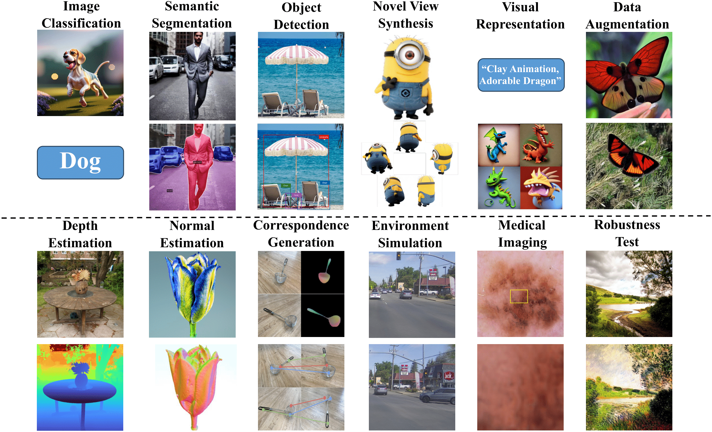

[](https://arxiv.org/abs/2310.01830)
[](https://github.com/sindresorhus/awesome) 
[](https://GitHub.com/Naereen/StrapDown.js/graphs/commit-activity) 
[](http://makeapullrequest.com) 
[](https://github.com/Naereen/StrapDown.js/blob/master/LICENSE)  
This project is associated with our survey paper which comprehensively contextualizes the advance of the recent **AI**-**G**enerated Images as Data **S**ource (**AIGS**) and visual AIGC by formulating taxonomies according to methodologies and applications.



**AI-Generated Images as Data Source: The Dawn of Synthetic Era** [[Paper](https://arxiv.org/abs/2310.01830)]  
*Zuhao Yang, Fangneng Zhan, Kunhao Liu, Muyu Xu, Shijian Lu*  
arXiv, 2023 

<br>

[](http://makeapullrequest.com) 
You are welcome to promote papers via pull request. <br>
The process to submit a pull request:
- a. Fork the project into your own repository.
- b. Add the Title, Author, Conference, Paper link, Project link, and Code link in `README.md` with below format:
```
**Title**<br>
*Author*<br>
Conference
[[Paper](Paper link)]
[[Project](Project link)]
[[Code](Code link)]
[[Video](Video link)]
```
- c. Submit the pull request to this branch.

<br>

## Related Surveys & Projects
**Machine Learning for Synthetic Data Generation: A Review**  
*Yingzhou Lu, Minjie Shen, Huazheng Wang, Wenqi Wei*  
arXiv 2023 [[Paper](https://arxiv.org/abs/2302.04062)]

**Synthetic Data in Human Analysis: A Survey**  
*Indu Joshi, Marcel Grimmer, Christian Rathgeb, Christoph Busch, Francois Bremond, Antitza Dantcheva*  
arXiv 2022 [[Paper](https://arxiv.org/abs/2208.09191)]

**A Review of Synthetic Image Data and Its Use in Computer Vision**  
*Keith Man, Javaan Chahl*  
J. Imaging 2022 [[Paper](https://www.mdpi.com/2313-433X/8/11/310)]

**Survey on Synthetic Data Generation, Evaluation Methods and GANs**  
*Alvaro Figueira, Bruno Vaz*  
Mathematics 2022 [[Paper](https://www.mdpi.com/2227-7390/10/15/2733)]


## Table of Contents (Work in Progress)
Methods:
- [Generative Models](#GenerativeModels-link)
  - [Label Acquisition](#GenLabelAcquisition-link)
  - [Data Augmentation](#GenDataAugmentation-link)
- [Neural Rendering](#NeuralRendering-link)
  - [Label Acquisition](#NeuLabelAcquisition-link)
  - [Data Augmentation](#NeuDataAugmentation-link)

Applications:
- [2D Visual Perception](#2DVisualPerception-link)
  - [Image Classification](#Classification-link)
  - [Image Segmentation](#Segmentation-link)
  - [Object Detection](#Detection-link)
- [Visual Generation](#VisualGeneration-link)
- [Self-supervised Learning](#SelfsupervisedLearning-link)
- [3D Visual Perception](#3DVisualPerception-link)
  - [Robotics](#Robotics-link)
  - [Autonomous Driving](#AutonomousDriving-link)
- [Other Applications](#OtherApplications-link)
  - [Medical](#Medical-link)
  - [Testing Data](#Test-link)

Datasets:
- [Datasets](#Datasets-link)


# Methods

## Generative Models
<a id="GenerativeModels-link"></a>

### Label Acquisition
<a id="GenLabelAcquisition-link"></a>

**[BigGAN] Large Scale GAN Training for High Fidelity Natural Image Synthesis**  
*Andrew Brock, Jeff Donahue, Karen Simonyan*  
ICLR 2019 [[Paper](https://arxiv.org/abs/1809.11096)]

**[VQ-Diffusion] Vector Quantized Diffusion Model for Text-to-Image Synthesis**  
*Shuyang Gu, Dong Chen, Jianmin Bao, Fang Wen, Bo Zhang, Dongdong Chen, Lu Yuan, Baining Guo*  
CVPR 2022 [[Paper](https://arxiv.org/abs/2111.14822)][[Code](https://github.com/cientgu/VQ-Diffusion#vector-quantized-diffusion-model-for-text-to-image-synthesis-cvpr2022-oral)]

**[LDM] High-Resolution Image Synthesis with Latent Diffusion Models**  
*Robin Rombach, Andreas Blattmann, Dominik Lorenz, Patrick Esser, Björn Ommer*  
CVPR 2022 [[Paper](https://arxiv.org/abs/2112.10752)][[Code](https://github.com/CompVis/latent-diffusion)]

**[Imagen] Photorealistic Text-to-Image Diffusion Models with Deep Language Understanding**  
*Chitwan Saharia, William Chan, Saurabh Saxena, Lala Li, Jay Whang, Emily Denton, Seyed Kamyar Seyed Ghasemipour, Burcu Karagol Ayan, S. Sara Mahdavi, Rapha Gontijo Lopes, Tim Salimans, Jonathan Ho, David J Fleet, Mohammad Norouzi*  
NeurIPS 2022 [[Paper](https://arxiv.org/abs/2205.11487)][[Project](https://imagen-ai.com/?v=0j)]

**[DALL-E 2] Hierarchical Text-Conditional Image Generation with CLIP Latents**  
*Aditya Ramesh, Prafulla Dhariwal, Alex Nichol, Casey Chu, Mark Chen*  
arXiv 2022 [[Paper](https://arxiv.org/abs/2204.06125)]

**GLIDE: Towards Photorealistic Image Generation and Editing with Text-Guided Diffusion Models**  
*Alex Nichol, Prafulla Dhariwal, Aditya Ramesh, Pranav Shyam, Pamela Mishkin, Bob McGrew, Ilya Sutskever, Mark Chen*  
ICML 2022 [[Paper](https://arxiv.org/abs/2112.10741)][[Code](https://github.com/openai/glide-text2im)]

**Integrating Geometric Control into Text-to-Image Diffusion Models for High-Quality Detection Data Generation via Text Prompt**  
*Kai Chen, Enze Xie, Zhe Chen, Lanqing Hong, Zhenguo Li, Dit-Yan Yeung*  
arXiv 2023 [[Paper](https://arxiv.org/abs/2306.04607)][[Project](https://kaichen1998.github.io/projects/geodiffusion/)]

**DatasetGAN: Efficient Labeled Data Factory with Minimal Human Effort**  
*Yuxuan Zhang, Huan Ling, Jun Gao, Kangxue Yin, Jean-Francois Lafleche, Adela Barriuso, Antonio Torralba, Sanja Fidler*   
CVPR 2021 [[Paper](https://arxiv.org/abs/2104.06490)][[Project](https://nv-tlabs.github.io/datasetGAN/)][[Code](https://github.com/nv-tlabs/datasetGAN_release/tree/master)]

**BigDatasetGAN: Synthesizing ImageNet with Pixel-wise Annotations**  
*Daiqing Li, Huan Ling, Seung Wook Kim, Karsten Kreis, Adela Barriuso, Sanja Fidler, Antonio Torralba*  
CVPR 2022 [[Paper](https://arxiv.org/abs/2201.04684)][[Project](https://nv-tlabs.github.io/big-datasetgan/)][[Code](https://github.com/nv-tlabs/bigdatasetgan_code)]

**HandsOff: Labeled Dataset Generation With No Additional Human Annotations**  
*Austin Xu, Mariya I. Vasileva, Achal Dave, Arjun Seshadri*  
CVPR 2023 [[Paper](https://arxiv.org/abs/2212.12645)][[Project](https://austinxu87.github.io/handsoff/)][[Code](https://github.com/austinxu87/handsoff/)]

On the generation of realistic synthetic petrographic datasets using a style-based GAN

Learning to Annotate Part Segmentation with Gradient Matching

Histopathology DatasetGAN: Synthesizing Large-Resolution Histopathology Datasets

Application of DatasetGAN in medical imaging: preliminary studies

Medical Image Segmentation Using Deep Learning: A Survey

Transformation-Consistent Self-Ensembling Model for Semisupervised Medical Image Segmentation

A Data Augmentation Pipeline to Generate Synthetic Labeled Datasets of 3D Echocardiography Images Using a GAN

### Data Augmentation
<a id="GenDataAugmentation-link"></a>
**A data augmentation perspective on diffusion models and retrieval**  
*Max F. Burg, Florian Wenzel, Dominik Zietlow, Max Horn, Osama Makansi, Francesco Locatello, Chris Russell*  
arXiv 2023 [[Paper](https://arxiv.org/abs/2304.10253)]

**Effective Data Augmentation With Diffusion Models**  
*Brandon Trabucco, Kyle Doherty, Max Gurinas, Ruslan Salakhutdinov*  
arXiv 2023 [[Paper](https://arxiv.org/abs/2302.07944)][[Project](http://btrabuc.co/da-fusion/)]

**Skin Lesion Classification Using GAN based Data Augmentation**  
*Rashid Haroon, Tanveer M. Asjid, Aqeel Khan Hassan*  
EMBC 2019 [[Paper](https://ieeexplore.ieee.org/document/8857905)]

GAN-based synthetic medical image augmentation for increased CNN performance in liver lesion classification

Data augmentation generative adversarial networks

Gan augmentation: Augmenting training data using generative adversarial networks

Enhancement of Image Classification Using Transfer Learning and GAN-Based Synthetic Data Augmentation

Diversify your vision datasets with automatic diffusion-based augmentation


## Neural Rendering
<a id="NeuralRendering-link"></a>

### Label Acquisition
<a id="NeuLabelAcquisition-link"></a>


### Data Augmentation
<a id="NeuDataAugmentation-link"></a>


# Applications

## 2D Visual Perception
<a id="2DVisualPerception-link"></a>

### Image Classification
<a id="Classification-link"></a>
**Is synthetic data from generative models ready for image recognition?**  
*Ruifei He, Shuyang Sun, Xin Yu, Chuhui Xue, Wenqing Zhang, Philip Torr, Song Bai, Xiaojuan Qi*  
ICLR 2023 [[Paper](https://arxiv.org/abs/2206.09592)][[Code](https://github.com/CVMI-Lab/SyntheticData)]

**Synthetic Data from Diffusion Models Improves ImageNet Classification**  
*Shekoofeh Azizi, Simon Kornblith, Chitwan Saharia, Mohammad Norouzi, David J. Fleet*  
arXiv 2023 [[Paper](https://arxiv.org/abs/2304.08466)]

**Adapting Pretrained Vision-Language Foundational Models to Medical Imaging Domains**  
*Pierre Chambon, Christian Bluethgen, Curtis P. Langlotz, Akshay Chaudhari*  
NeurIPS 2022 [[Paper](https://arxiv.org/abs/2210.04133)]

**OpenGAN: Open-Set Recognition via Open Data Generation**  
*Shu Kong, Deva Ramanan*  
ICCV 2021 [[Paper](https://arxiv.org/abs/2104.02939)][[Project](https://www.cs.cmu.edu/~shuk/OpenGAN.html)][[Code](https://github.com/aimerykong/OpenGAN)][[Video](https://www.youtube.com/watch?v=CNYqYXyUHn0)]

Image Captions are Natural Prompts for Text-to-Image Models

Diffusion Models and Semi-Supervised Learners Benefit Mutually with Few Labels

### Image Segmentation
<a id="Segmentation-link"></a>
**Learning Semantic Segmentation from Synthetic Data: A Geometrically Guided Input-Output Adaptation Approach**  
*Yuhua Chen, Wen Li, Xiaoran Chen, Luc Van Gool*  
CVPR 2019 [[Paper](https://arxiv.org/abs/1812.05040)]

**Semantic Segmentation with Generative Models: Semi-Supervised Learning and Strong Out-of-Domain Generalization**  
*Daiqing Li, Junlin Yang, Karsten Kreis, Antonio Torralba, Sanja Fidler*  
CVPR 2021 [[Paper](https://arxiv.org/abs/2104.05833)][[Project](https://nv-tlabs.github.io/semanticGAN/)][[Code](https://github.com/nv-tlabs/semanticGAN_code)]

**Repurposing GANs for One-shot Semantic Part Segmentation**  
*Nontawat Tritrong, Pitchaporn Rewatbowornwong, Supasorn Suwajanakorn*  
CVPR 2021 [[Paper](https://arxiv.org/abs/2103.04379)][[Project](https://repurposegans.github.io/)][[Code](https://github.com/bryandlee/repurpose-gan/)]

**Diffusion Models for Zero-Shot Open-Vocabulary Segmentation**  
*Laurynas Karazija, Iro Laina, Andrea Vedaldi, Christian Rupprecht*  
arXiv 2023 [[Paper](https://arxiv.org/abs/2306.09316)]

**DifFSS: Diffusion Model for Few-Shot Semantic Segmentation**  
*Weimin Tan, Siyuan Chen, Bo Yan*  
arXiv 2023 [[Paper](https://arxiv.org/abs/2307.00773)]

Semantic Segmentation with Generative Models: Semi-Supervised Learning and Strong Out-of-Domain Generalization

Few-shot 3D Multi-modal Medical Image Segmentation using Generative Adversarial Learning

Segmentation in Style: Unsupervised Semantic Image Segmentation with Stylegan and CLIP

ODISE

### Object Detection
<a id="Detection-link"></a>
**DALL-E for Detection: Language-driven Compositional Image Synthesis for Object Detection**  
*Yunhao Ge, Jiashu Xu, Brian Nlong Zhao, Neel Joshi, Laurent Itti, Vibhav Vineet*  
arXiv 2022 [[Paper](https://arxiv.org/abs/2206.09592)]

**Explore the Power of Synthetic Data on Few-shot Object Detection**  
*Shaobo Lin, Kun Wang, Xingyu Zeng, Rui Zhao*   
CVPR 2023 [[Paper](https://arxiv.org/abs/2303.13221)]

**The Big Data Myth: Using Diffusion Models for Dataset Generation to Train Deep Detection Models**  
*Roy Voetman, Maya Aghaei, Klaas Dijkstra*  
arXiv 2023 [[Paper](https://arxiv.org/abs/2306.09762)]

IMAGINARYNET: LEARNING OBJECT DETECTORS WITHOUT REAL IMAGES AND ANNOTATIONS

Integrating Geometric Control into Text-to-Image Diffusion Models for High-Quality Detection Data Generation via Text Prompt


## Visual Generation
<a id="VisualGeneration-link"></a>
**Re-Aging GAN: Toward Personalized Face Age Transformation**  
*Farkhod Makhmudkhujaev, Sungeun Hong, and In Kyu Park*  
ICCV 2021 [[Paper](https://openaccess.thecvf.com/content/ICCV2021/papers/Makhmudkhujaev_Re-Aging_GAN_Toward_Personalized_Face_Age_Transformation_ICCV_2021_paper.pdf)][[Video](https://www.youtube.com/watch?v=NRl0GPgtcBY)]

**Only a Matter of Style: Age Transformation Using a Style-Based Regression Model**  
*Yuval Alaluf, Or Patashnik, Daniel Cohen-Or*  
SIGGRAPH 2021 [[Paper](https://arxiv.org/abs/2102.02754)][[Project](https://yuval-alaluf.github.io/SAM/)][[Code](https://github.com/yuval-alaluf/SAM)][[Video](https://www.youtube.com/watch?v=X_pYC_LtBFw)]

**Production-Ready Face Re-Aging for Visual Effects**  
*Gaspard Zoss, Prashanth Chandran, Eftychios Sifakis, Markus Gross, Paulo Gotardo, Derek Bradley*  
TOG 2021 [[Paper](https://studios.disneyresearch.com/app/uploads/2022/10/Production-Ready-Face-Re-Aging-for-Visual-Effects.pdf)][[Project](https://studios.disneyresearch.com/2022/11/30/production-ready-face-re-aging-for-visual-effects/)][[Video](https://www.youtube.com/watch?v=ZP1ApcdyAjk)]

**Zero-1-to-3: Zero-shot One Image to 3D Object**  
*Ruoshi Liu, Rundi Wu, Basile Van Hoorick, Pavel Tokmakov, Sergey Zakharov, Carl Vondrick*  
ICCV 2023 [[Paper](https://arxiv.org/abs/2303.11328)][[Project](https://zero123.cs.columbia.edu/)][[Code](https://github.com/cvlab-columbia/zero123)]

**DreamBooth3D: Subject-Driven Text-to-3D Generation**  
*Amit Raj, Srinivas Kaza, Ben Poole, Michael Niemeyer, Nataniel Ruiz, Ben Mildenhall, Shiran Zada, Kfir Aberman, Michael Rubinstein, Jonathan Barron, Yuanzhen Li, Varun Jampani*   
arXiv 2023 [[Paper](https://arxiv.org/abs/2303.13508)][[Project](https://dreambooth3d.github.io/)][[Video](https://youtu.be/kKVDrbfvOoA)]

**StyleAvatar3D: Leveraging Image-Text Diffusion Models for High-Fidelity 3D Avatar Generation**  
*Chi Zhang, Yiwen Chen, Yijun Fu, Zhenglin Zhou, Gang YU, Billzb Wang, Bin Fu, Tao Chen, Guosheng Lin, Chunhua Shen*  
arXiv 2023 [[Paper](https://arxiv.org/abs/2305.19012)]


## Self-supervised Learning
<a id="SelfsupervisedLearning-link"></a>
**Generative Models as a Data Source for Multiview Representation Learning**  
*Ali Jahanian, Xavier Puig, Yonglong Tian, Phillip Isola*  
ICLR 2022 [[Paper](https://arxiv.org/abs/2106.05258)][[Project](https://ali-design.github.io/GenRep/)][[Code](https://github.com/ali-design/GenRep)][[Video](https://www.youtube.com/watch?v=qYmGvVrGZno)]

**StableRep: Synthetic Images from Text-to-Image Models Make Strong Visual Representation Learners**  
*Yonglong Tian, Lijie Fan, Phillip Isola, Huiwen Chang, Dilip Krishnan*  
arXiv 2023 [[Paper](https://arxiv.org/abs/2306.00984)]

Ensembling with Deep Generative Views

DreamTeacher: Pretraining Image Backbones with Deep Generative Models


## 3D Visual Perception
<a id="3DVisualPerception-link"></a>

### Robotics
<a id="Robotics-link"></a>
**NeRF-Supervision: Learning Dense Object Descriptors from Neural Radiance Fields**  
*Thomas Lips, Victor-Louis De Gusseme, Francis wyffels*  
ICRA 2022 [[Paper](https://arxiv.org/abs/2203.01913)][[Project](https://yenchenlin.me/nerf-supervision/)][[Code](https://github.com/yenchenlin/nerf-supervision-public)][[Video](https://www.youtube.com/watch?v=_zN-wVwPH1s)]

INeRF: Inverting Neural Radiance Fields for Pose Estimation

VMRF: View Matching Neural Radiance Fields

LENS: Localization enhanced by NeRF synthesis

Gan-based neural radiance field without posed camera

NeRF-Pose: A First-Reconstruct-Then-Regress Approach for Weakly-supervised 6D Object Pose Estimation

Vision-only robot navigation in a neural radiance world

Event-based Camera Tracker by ∇t NeRF


### Autonomous Driving
<a id="AutonomousDriving-link"></a>
Lift3D: Synthesize 3D Training Data by Lifting 2D GAN to 3D Generative Radiance Field

3D Data Augmentation for Driving Scenes on Camera

UniSim: A Neural Closed-Loop Sensor Simulator

MARS: An Instance-aware, Modular and Realistic Simulator for Autonomous Driving


## Other Applications
<a id="OtherApplications-link"></a>

### Medical
<a id="Medical-link"></a>

### Testing Data
<a id="Test-link"></a>


## Datasets
<a id="Datasets-link"></a>
**DiffusionDB: A Large-scale Prompt Gallery Dataset for Text-to-Image Generative Models**  
*Zijie J. Wang, Evan Montoya, David Munechika, Haoyang Yang, Benjamin Hoover, Duen Horng Chau*  
ACL 2023 [[Paper](https://arxiv.org/abs/2210.14896)][[Project](https://poloclub.github.io/diffusiondb/)][[Code](https://github.com/poloclub/diffusiondb)]

**JourneyDB: A Benchmark for Generative Image Understanding**  
*Junting Pan, Keqiang Sun, Yuying Ge, Hao Li, Haodong Duan, Xiaoshi Wu, Renrui Zhang, Aojun Zhou, Zipeng Qin, Yi Wang, Jifeng Dai, Yu Qiao, Hongsheng Li*  
arXiv 2023 [[Paper](https://arxiv.org/abs/2307.00716)][[Project](https://journeydb.github.io/)][[Code](https://github.com/JourneyDB/JourneyDB)]

**GenImage: A Million-Scale Benchmark for Detecting AI-Generated Image**  
*Mingjian Zhu, Hanting Chen, Qiangyu Yan, Xudong Huang, Guanyu Lin, Wei Li, Zhijun Tu, Hailin Hu, Jie Hu, Yunhe Wang*  
arXiv 2023 [[Paper](https://arxiv.org/abs/2306.08571)][[Project](https://genimage-dataset.github.io/)][[Code](https://github.com/GenImage-Dataset/GenImage)]

DiffusionDB (https://huggingface.co/datasets/poloclub/diffusiondb)  

JourneyDB (https://docs.google.com/forms/d/e/1FAIpQLSeiciK0g0IA46_hFaitRhdpihhpjqt3helJNT68y-C8MfKhiQ/viewform?pli=1)  

GenImage (https://pan.baidu.com/share/init?surl=i0OFqYN5i6oFAxeK6bIwRQ#list/path=%2F)  


## Citation
If you use this code for your research, please cite our papers.
```bibtex
@article{yang2023aigs,
  title={AI-Generated Images as Data Source: The Dawn of Synthetic Era},
  author={Zuhao Yang and Fangneng Zhan and Kunhao Liu and Muyu Xu and Shijian Lu},
  journal={arXiv preprint arXiv:2310.01830},
  year={2023}
}
```
